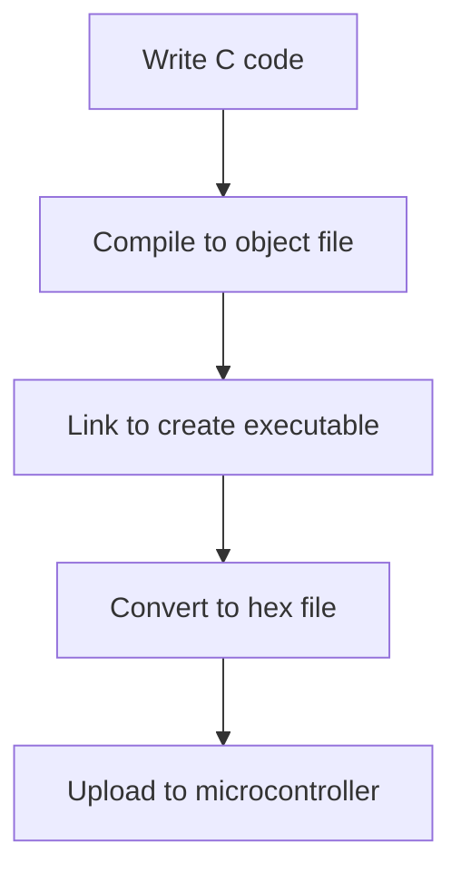

# How .c code is compieled into final .hex file

When we write code in C, it goes through several stages before it becomes a final .hex file that can be loaded onto a microcontroller. Here's a simplified overview of the compilation process:

```bash
avr-gcc -Os -DF_CPU=16000000UL -mmcu=atmega328p -c -o main.o main.c
avr-gcc -mmcu=atmega328p main.o -o main.elf
avr-objcopy -O ihex -R .eeprom main.elf main.hex
avrdude -F -V -c arduino -p m328p -P COM3 -b 115200 -U flash:w:main.hex
```

1. **Compilation**: The first command compiles the `main.c` file into an object file `main.o`. The `-Os` flag optimizes the code for size, `-DF_CPU=16000000UL` defines the clock speed, and `-mmcu=atmega328p` specifies the target microcontroller.

2. **Linking**: The second command links the object file `main.o` to create an executable file `main.elf`. This step resolves any references to functions and variables.

3. **Hex Conversion**: The third command converts the `main.elf` file into a hexadecimal format (`main.hex`) that can be loaded onto the microcontroller. The `-O ihex` option specifies the output format, and `-R .eeprom` tells the tool to ignore the EEPROM section.

4. **Uploading**: The final command uses `avrdude` to upload the `main.hex` file to the microcontroller. The `-F` flag forces the upload, `-V` disables verification, `-c arduino` specifies the programmer type, `-p m328p` specifies the microcontroller model, `-P COM3` specifies the port, and `-b 115200` sets the baud rate.

## Workflow Diagram



This process allows us to take our high-level C code and turn it into a format that can be executed on a microcontroller, enabling us to create embedded applications.


## Makefile Integration

In practice, we often use a Makefile to automate this compilation process. The Makefile defines rules and dependencies for building the project, making it easier to manage and execute the necessary commands with a simple `make` command.


```# Example Makefile Commands
make Activity=labs/L1_register-control/lab-01-led-blink-asm/src
make Activity=foundations/0_Hello_Binary_World"
```